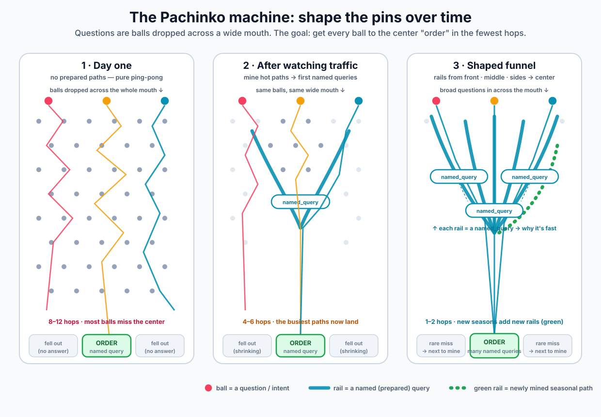

# Fine-tuning & end-goal optimization (Pachinko → named rails)

> **Doc status** · last reviewed **2026-07-26** · production pin **base-1** · candidate line **base-5.3** · version matrix: [COMPAT.md](../COMPAT.md)

**Audience:** product, catalog authors, Workbench / Hot Path operators, Helios Funnel  
**Not:** day-one general retrieval playbook (that is [BEST_PRACTICES.md](BEST_PRACTICES.md))  
**Companion diagram:** [../images/zeus-pachinko-shaping.svg](../images/zeus-pachinko-shaping.svg) · also business docs `img/` · Zeus `docs/public/img/`  
**Related:** [ROADMAP.md](ROADMAP.md) (§ HINTS · Hot Path · base-7/8) · [HELIOS_WISHLIST](HELIOS_WISHLIST_FOR_CHAT_REQUEST.md) (Funnel / path stage) · Zeus [Funnel motion](https://github.com/koten-ai/Zeus/blob/main/docs/public/motions/FUNNEL.md) · OpenAPI **named queries** (PREPARED N1QL)  
**Jira (Hub Prompt Helper product):** [ZE-267](https://kotenai.atlassian.net/browse/ZE-267) — Hot Paths → `named_query` rails → **contracted** chat_request (parent [ZE-23](https://kotenai.atlassian.net/browse/ZE-23))

---

## 0. One-sentence thesis

Zeus starts as a **wide-mouth** natural-language board (many pins = many tool hops).  
Over time you **shape the pins into rails**: the top question patterns become **`named_query`** rails — Couchbase **SQL++ PREPARED** statements (and related governed paths) so traffic reaches **order / action** in **1–2 hops**, not 8–12 LLM↔Zeus rounds.

This is an **end-goal optimization**, not the default day-one best practice for every ad-hoc ask.

```text
Day one:     rain of questions → multi-hop AI + Zeus verbs (pachinko pins)
Mature:      rain of questions → few named rails → ORDER / book / dispatch
Seasonal:    new traffic → mine misses → new rails (green in the diagram)
```

---

## 1. The Pachinko picture



| Metaphor | Meaning |
| --- | --- |
| **Ball** | A question / intent dropped across a **wide mouth** (typos, synonyms, angles) |
| **Pin** | A tool hop / chat round (find, search, traverse, pipeline step, …) |
| **Rail** | A **named_query** (prepared path) that channels traffic |
| **ORDER (center slot)** | Goal completion: answer bag ready **or** governed action (book car, place order, …) |
| **Fell out** | No answer / refuse / timeout / permission / capability gap — next to mine |

### Stages (from the diagram)

| Stage | Board | Hops (illustrative) | What you do |
| --- | --- | --- | --- |
| **1 · Day one** | Full pin grid, no rails | 8–12 · many miss center | World model + verbs + BEST_PRACTICES playbook; observe traffic |
| **2 · After traffic** | First angled rails | 4–6 · busy paths land | Mine Hot Paths → first `named_query` rails |
| **3 · Shaped funnel** | Rails from front/middle/sides | **1–2** · rare miss | Top 5–10 patterns are fast-pass; seasonal green rails for new demand |

**Shape the funnel — don’t shrink the box.**  
That is the opposite of Path B2 (restrict chat so only form-shaped questions remain). See [ENTITY foundation](https://github.com/fujio-turner/zeus_design_docs/blob/main/ENTITY_TRANSACTION_ENTITY_FOUNDATION.md) Path B2 and Zeus Funnel motion docs.

---

## 2. What is a `named_query`?

**A:** In Zeus, a **named query** is an operator-defined, versioned, **Couchbase SQL++ PREPARED** statement stored per scope (e.g. `zeus_config::named_query:<name>`), invocable as a **governed tool/path** without writing new Go for every pattern.

| Property | Why it matters |
| --- | --- |
| **PREPARED** | Plan reuse, stable shape, predictable cost vs ad-hoc multi-hop AI planning |
| **Named** | Stable id for Hot Path, Helios Funnel (`path.named_query` / `rail_id`), A/B, audit |
| **Scoped** | Same tenancy / mode boundaries as the rest of Zeus |
| **Versioned / archive** | Safe evolve rails; rollback |
| **Parameterized** | User/entity slots (`$brewery_id`, `$limit`) — not free SQL from the model |

**Not the same as:**

| Concept | Difference |
| --- | --- |
| Ad-hoc `find` / `search` / `pipeline` | Flexible day-one exploration; more hops |
| Soft `hints.hot_path` | Prose bias toward a verb sequence — still multi-tool unless a rail exists |
| Hard `rules{}` | Policy law, not data path |
| Path B2 canned FAQ only | Shrinks the mouth; Zeus keeps the **wide mouth** and adds **rails** |

Mental model: **Candy Land chute / shoots-and-ladders / wormhole / fast-pass lane** from “I know this ask” → prepared execution → order/action.

---

## 3. Relationship to general best practices

| Layer | Doc | Role |
| --- | --- | --- |
| **General playbook** | [BEST_PRACTICES.md](BEST_PRACTICES.md) | Every scope, day one: field class → verb, recipes A–H, multi-intent |
| **Soft steer** | ROADMAP [§ HINTS](ROADMAP.md) | Per-turn bias without re-stamp |
| **End-goal rails** | **This doc** | Top patterns become **named_query** (and optional action hooks) |

```text
BEST_PRACTICES  →  how to play the pin grid safely
HINTS / Hot Path →  which paths are getting hot
named_query      →  turn a hot path into a rail (few hops)
Funnel motion    →  measure and operate the board (Helios)
```

Do **not** replace day-one playbook with “only call named_query.”  
Do **promote** repeated winning multi-hop shapes into rails over time.

---

## 4. Lifecycle: rain → mine → rail → order

### 4.1 Observe (wide mouth stays open)

- Chat + Detective: rounds, tool sequences, zero-rows, timeouts.  
- Helios **Funnel** motion: drop-off, stages, conversion (see HEL-WISH-014 path stage).  
- Workbench **Hot Paths / Path Finder**: multi-hop shapes for the scope.

Balls still drop across the **whole mouth** — natural language is not reduced to five form fields.

### 4.2 Mine (top 5–10 ideas / question patterns)

Cluster traffic into **intents / path shapes**, not raw user strings:

| Signal | Example pattern id |
| --- | --- |
| QD intent + entity_type | `List/Beer+fts_description` |
| Tool fingerprint | `search→order→project` |
| Join shape | `Brewery→Beer inverse_fk` |
| Terminal action | `book_vehicle`, `place_order` |

Target **5–10 rails per mature scope** first — enough coverage without catalog explosion. Seasonal demand adds rails (green path in the diagram), it does not require rewriting CORE every week.

### 4.3 Shape (publish a rail)

1. Author SQL++ (or promote a proven pipeline shape) as **`named_query:<name>`** with parameters + validation.  
2. Expose to the agent as a **callable verb/path** (catalog / mode allow-list / Workbench draft rail).  
3. Teach the model **when** to prefer the rail:
   - soft: `hints.hot_path` / `hints.path` (“prefer named_query fruit_beers when …”)  
   - harder product: Client router or tool_choice bias when classifier confidence high  
4. Keep general verbs for **misses** and novel asks (side bins → next to mine).

### 4.4 Prove (A/B the board)

- A/B Bench: rounds-to-order, success rate, named_query hit rate, fall-out class.  
- Promote rails that reduce hops **without** raising wrong-answer rate.  
- Retire or version rails that go cold.

### 4.5 Act (order is not only “rows”)

Center slot **ORDER** can mean:

| Outcome | Example |
| --- | --- |
| **Answer** | Ranked rows + Layer A terminate |
| **Governed side-effect** | Book a car, place order, open claim, dispatch tech |
| **Publish rail** | Operator action: ship a new named_query |

Action rails need the same discipline as SQL rails: parameters, authz, audit, idempotency — not free agent invention of mutations.

---

## 5. Fast-pass vs multi-turn AI (cost picture)

| Path | Typical cost | When |
| --- | --- | --- |
| Full pin grid (many tool rounds) | High AI ms + planning risk | Novel, multi-intent, exploratory |
| Soft hot_path hint only | Still multi-tool, better first guess | Early shaping |
| **named_query rail** | Low planning; PREPARED exec | Top patterns, stable schema |
| Action rail | Lowest UX friction if intent clear | Funnel bottom (book / order / …) |

End state for a mature deployment:

```text
most traffic  →  rail (1–2 hops)  →  order/action
tail traffic  →  general playbook (pins)  →  mine or fall-out
```

Helios Funnel metrics should eventually show **% traffic on named rails** and **avg hops** falling as the board shapes (not only “fewer user questions allowed”).

---

## 6. Optimization portfolio (ladder)

`named_query` rails are the **headline**, but they sit on a **ladder** of optimizations that all “shape the board” without shrinking the mouth. Day-one docs cover **1–2**. [ZE-267](https://kotenai.atlassian.net/browse/ZE-267) is mostly **3→6→contract**. The rest is product/engine portfolio.

```text
cheapest / always-on
  1  Inject quality (brief, mini-schema, ex: samples)
  2  Playbook + verb clarity (day-one pins)     ← BEST_PRACTICES / base-5.3
  3  Soft hints / hot_path (bias, no re-stamp) ← ROADMAP § HINTS
  4  Contracted catalog delta (custom stamp / mode pack)
  5  Named pipeline templates (multi-verb rail)
  6  named_query PREPARED (SQL++ fast-pass)    ← §§1–5 headline
  7  Intent→rail router (pre-LLM or light classifier)
  8  Action rails (book / order / dispatch)
  9  Materialized edges / walk_path / indexes (engine)
 10  Cache / prompt-cache / result cache
 11  Skinny stamped tool sets (empiric A/B)
expensive / later
```

**Filter for any new idea:** does it **add a rail**, **shorten pins**, or **measure shaping** — while keeping the **wide mouth**?  
If it only **forbids questions**, it is Path B2, not Zeus optimization.

### 6.1 Priority if you only build a few

| Pri | Idea | Why |
| --- | --- | --- |
| **P0** | SQL `named_query` rails (§§1–5) | Real hop reduction; PREPARED cost |
| **P0** | Pipeline / composite rails (§6.2) | Many hot paths aren’t one SELECT |
| **P0** | Intent→rail router (§6.3) | Skip planning, not only speed SQL |
| **P1** | Board release: stamp + rails + hints (§6.4) | “Contracted in” packaging |
| **P1** | Rail SLOs + demote (§6.5) | Fast-pass must not become fast-wrong |
| **P2** | Multi-intent compiler (§6.6) | Paragraph traffic |
| **P2** | Partial rails + value normalization (§6.7–6.8) | Mid-board chutes; zero-row loops |
| **P2** | Seasonal rail packs (§6.9) | Green rails in the diagram |
| **P3** | Result / prompt cache (§6.10) | Orthogonal speed |
| **P3** | Mode board density (§6.11) | open vs analytics rail policy |
| **P3** | HITL approve queue + action two-phase ORDER (§6.12–6.13) | Operator time; book-car Funnel |

---

## 6.2 Rail types (not only SQL++)

Some hot paths are `search→order→project` with no single SQL that feels natural. Treat **rail** as a product type:

| Rail type | What it is | Example |
| --- | --- | --- |
| **SQL rail** | `named_query` PREPARED | `named_query:top_abv_beer` |
| **Pipeline / composite rail** | Frozen multi-verb steps + param slots; one agent invocation | `search→order field:abv→project` template |
| **Hybrid rail** | NQ for ids → fixed project / enrich | PREPARED seeds + cheap shape |
| **Partial rail** | Only the expensive middle or seed resolution | “resolve Pliny → brewery_id” then playbook |
| **Action rail** | Governed side-effect after answer | book / order / dispatch (§4.5, §6.13) |

Same Pachinko diagram; different **rail material**. ZE-267 should draft SQL rails first, then composite rails when Hot Paths are multi-verb.

---

## 6.3 Intent → rail router (pre- or co-LLM)

Before a full 13-verb think, a **cheap** step:

```text
user / embedding / small classifier
  → high confidence: call named_query | force tool_choice on rail
  → low confidence: full pin grid (playbook)
```

That is the real **wormhole**: not only a faster query, but **skipping planning**.

| Metric | Meaning |
| --- | --- |
| `% first-tool = named_query` | Router + teach working |
| Avg AI rounds when rail hit vs miss | Board shaping |
| Wrong-rail rate | Router / rail quality |

Client or Zeus can own the router; Prompt Helper proposes **when** strings and confidence thresholds for contract.

---

## 6.4 Board release (contract as packaging)

Helper output is eventually **contracted in**. A **board release** is one deployable unit:

| Artifact | What it binds |
| --- | --- |
| Custom / stamped chat_request | Playbook bias, soft teach for rails, optional skinny verbs |
| `named_query` set (versioned) | PREPARED + params |
| Default `hints.hot_path` / `hints.path` | Tenant hot list without re-stamp thrash on every experiment |
| Optional deployment_id / ruleset | Helios A/B of “shaped board” vs day-one grid |

A/B compares **board releases**, not only model temperature.  
Does **not** invent production `contract_hash` inside Helper — stamp/publish stays Hub workflow.

---

## 6.5 Rail quality SLOs + demote

Treat each rail like a product API:

| SLO | Example |
| --- | --- |
| p95 latency | PREPARED exec budget |
| Empty rate | Param / data drift |
| Error rate | Statement / authz |
| Wrong-answer samples | Spot books / human review |

**Auto demote** (or archive) if SLO breaks → balls return to pin grid for that pattern.  
Keeps “fast-pass” from becoming “fast wrong.” Helios / admin should show rail health next to hit rate.

---

## 6.6 Multi-intent compiler

Paragraph multi-ask is playbook ([BEST_PRACTICES §3](BEST_PRACTICES.md)); **optimization** is a compiler:

```text
paragraph → parts[]
  → independent parts: parallel NQs / recipes
  → dependent parts: ordered pipeline
  → combine: set union/intersect when two bags
  → budget: if >N parts → clarify or Client multi-round
```

Output can be a **single multi-rail plan** the model only fills parameters for — fewer free-form tool invents.

Optional soft inject: `hints.multipart` (ROADMAP § HINTS).

---

## 6.7 Partial rails / mid-board chutes

Not every pattern needs mouth→ORDER in one shot:

| Partial rail | Effect |
| --- | --- |
| Seed resolution only | “resolve entity X → id” then general playbook |
| Expensive middle only | Big FTS/hybrid as NQ; AI only terminates |
| Rank tail only | Candidate bag in → `order`/`project` template |

Reduces average hops without requiring a full funnel win on day two.

---

## 6.8 Parameter dictionaries / value normalization

`ex:` trailers teach conventions; optimization is **automatic normalize**:

- user “UK” → `United Kingdom` via map or NQ param coercion  
- style / city synonyms  
- **Fail closed**: unknown → fall back to FTS pin path (not invent)

Cuts zero-row loops that look like “bad AI” but are **value shape** problems.

---

## 6.9 Seasonal / campaign rail packs

Diagram **green rail** = seasonal demand:

- versioned **pack of rails** per season/campaign  
- auto-expire or archive  
- Helios `deployment_id` / ruleset = which rail pack is live  

Optimization is not only “more rails forever” — it is **lifecycle** of rails (promote, expire, replace).

---

## 6.10 Result cache + prompt-prefix cache

Even without a new NQ:

| Cache | Effect |
| --- | --- |
| Brief / mini-schema inject | Already “free orientation” vs `describe` |
| NQ result by param hash (TTL) | Identical balls → zero re-exec |
| Multi-turn same NQ params | Don’t re-run |
| Provider prompt-prefix cache | Stable catalog+company+rules+rail list; dirty user/brief only (ROADMAP base-8) |

Orthogonal to named_query but same goal: less wall time and less AI ms.

---

## 6.11 Mode-specific board density

Same Pachinko; different **rail density** and fall-out policy (see DESIGN §14.7):

| Mode | Optimization flavor |
| --- | --- |
| **analytics** | NQ for top BI patterns; tight joins; multi-intent OK |
| **open** | More exploratory pins early; fewer premature NQs; sample-then-expand; accept noise |
| **fraud** | NQ for known typologies + keep weak-signal hops open |
| **code** | NQ for “callers of X”, “impls of Y”; deeper hops when pins remain |
| **research** | Citation / backlink rails + semantic when needed |
| **tenant / regulated** | Fewer speculative pins; NQ must be audit-friendly; scope wall hard |
| **private** | Local graph rails; no fake corpus stats |
| **auto** | Almost no permanent rails until named mode commits |

Do **not** switch to `open` only because the user wrote a multi-ask paragraph — that is multi-intent compiler / playbook, not mode.

---

## 6.12 Confidence-gated ORDER + human-in-the-loop

| Gate | Behavior |
| --- | --- |
| High intent + rail hit | Terminate faster; lighter soft Layer A |
| Low confidence | More pins, or `policy_action: clarify` |
| Operator HITL | Helper proposes rail → **one-click approve** → PREPARE + optional stamp candidate |

Optimizes **when to stop thinking** and **operator time**, not only fetch latency. Fits ZE-267 Slice A/B.

---

## 6.13 Action rails as two-phase ORDER

“Book a car” is rarely one free agent hop:

```text
1) Answer rail  — candidates (availability, price, constraints)
2) Action rail  — book with idempotency key, policy table, optional human confirm
```

Funnel bottom can still be **fewer hops than free planning** even if it is two governed steps.  
Authz, audit, idempotency required — same discipline as SQL rails.

---

## 6.14 Negative rails / “do not go there”

Mine **fall-out** and **bad paths**:

| Source | Publish as |
| --- | --- |
| Always-empty FTS shapes | `hints.avoid_patterns` or books |
| Timeout patterns | budget / timeout_ms defaults |
| Mode / permission denials | capability gap ticket, not a rail |

Side bins feed the **next green rail** *or* a blocked chute (schema/index/product gap). Negative teach is soft unless stamped policy.

---

## 6.15 Cross-scope rail patterns (careful)

Tenant-safe **templates**: same NQ shape, different scope binding (portability / D2P spirit).  
Only where boundary model allows — never one global PREPARE that crosses tenant walls.

---

## 6.16 Skinny stamped tool sets (empiric)

After Hot Path shows 3 of 13 verbs unused:

- **New stamp / A/B arm** with fewer tools on the wire (not mid-session strip under enforcement)  
- General pin grid remains for admin / workbench / full packs  

Complements rails: fewer pins **and** more rails on the product board.

---

## 7. Helios Funnel alignment

| Helios concern | Optimization story |
| --- | --- |
| Funnel motion | Goal-directed path to action; wide mouth in, bounded outcome out |
| `path.stage` / rail_id / named_query (HEL-WISH-014, path scalars) | Report which balls rode which rail |
| Drop-off | Side bins: no answer, refuse, error, permission |
| Deployment / ruleset | A/B “shaped board” vs day-one pin grid; seasonal rail packs |
| Tool fingerprint (HEL-WISH-021) | Mine candidates for the next rail |
| Named-query hit rate / avg hops | Board maturity KPIs (§5, §6.5) |

Cheap Zeus/Client path metrics beat forcing the model to emit funnel stages every turn ([HELIOS cost law](HELIOS_WISHLIST_FOR_CHAT_REQUEST.md)).

---

## 8. What this is *not*

| Anti-goal | Why |
| --- | --- |
| Day-one “only named_query” | No rails yet; mouth would empty into fall-out |
| Path B2: shrink chat to five canned questions | Destroys wide mouth; freezes product |
| Unbounded agent SQL | PREPARED + validate + scope RBAC only |
| Replacing mini-schema / world model | Rails sit **on top of** overlay data, not instead of it |
| Runtime strip of general verbs under same stamp | Novel balls still need pins; skinny catalogs are separate stamps |
| Soft hints as only policy | Jailbreak / tenancy stay hard rules + engine mode |
| Forever-growing rail list without SLOs | Stale rails → fast wrong; demote/archive (§6.5) |
| Switch mode to `open` for multi-paragraph asks | Multi-intent compiler / playbook — not exploration bias |

---

## 9. Operator checklist (close the loop)

1. **Observe** Funnel + Hot Paths + Detective slow/error packs.  
2. **Triage** each fall-out: prompt fix vs new rail vs capability/schema gap.  
3. **Draft rail** (Workbench Hot Paths → named_query and/or pipeline template).  
4. **Wire teach** (`hints.hot_path` and/or catalog verb entry; optional router rule).  
5. **A/B** board release (rounds, conversion, rail hit rate, wrong-rail rate).  
6. **Publish** versioned named_query; archive losers; enforce rail SLOs.  
7. **Season** — new product season ⇒ new green rails, not a full BASE rewrite.  
8. **Contract** — stamp custom / pin path so Helper output is durable (ZE-267 Slice B).

---

## 10. Implementation horizons (where work lives)

| Horizon | Work | Owner |
| --- | --- | --- |
| **Now** | BEST_PRACTICES + verb clarity + world model (pin grid skills) | chat_request packs |
| **Near** | Hot Path mine → draft rail → hints.hot_path | Workbench / CR-26 residual / base-6 hints |
| **Product (ZE-267)** | Prompt Helper propose → draft NQ → **contract** path; Pachinko framing in Display Pad | Hub Prompt Helper |
| **Product** | named_query admin + execute + metrics (OpenAPI exists) | Zeus targets + Hub |
| **Router / composite rails** | Intent→rail; pipeline templates | Zeus + Client + Helper |
| **Funnel ops** | path.stage, rail_id, hit rate, rail SLOs on report | Zeus + Helios |
| **Action rails** | book/order/dispatch two-phase ORDER | Product + Client policy |
| **Cache / prompt-cache** | Result TTL; stable prefix zones | Zeus / Client / provider |

ROADMAP home: **named rails + portfolio** under Funnel / Hot Path / base-6 hints / base-7 Workbench / [ZE-267](https://kotenai.atlassian.net/browse/ZE-267) — not a base-5.3 day-one pack requirement.

### ZE-267 slice mapping (Helper)

| ZE-267 slice | Portfolio items |
| --- | --- |
| **A Propose** | Hot Path rank, rail candidates, Pachinko framing |
| **B Contract** | Board release (stamp + rails + hints); no invented contract_hash |
| **C Prove** | A/B hops, hit rate, fall-out; rail SLOs |
| **D Action** | Two-phase ORDER / book-car style rails |

---

## 11. One-pager for talks

> Questions fall into Zeus like balls in a Pachinko machine. Day one, every pin is a tool hop — slow, messy, but the mouth is wide. Watch the traffic, mine the top paths, and bolt on **named_query rails** (SQL++ PREPARED fast lanes) — plus pipeline rails, routers, and seasonal packs as the board matures. Most balls reach **order** in one or two hops — including real actions like booking a car — while rare misses still use the open playbook and become the next rail. **Shape the funnel; don’t shrink the box.**

---

## Doc ownership

| Doc | Role |
| --- | --- |
| **This file** | End-goal fine-tuning / Pachinko / named rails / **optimization portfolio** |
| [BEST_PRACTICES.md](BEST_PRACTICES.md) | Day-one playbook (pins) |
| [ROADMAP.md](ROADMAP.md) § HINTS · sequencing | Soft hot_path inject; when rails enter product trains |
| [ZE-267](https://kotenai.atlassian.net/browse/ZE-267) | Prompt Helper → rails → contract |
| Zeus Funnel motion + OpenAPI named queries | Engine rails + admin lifecycle |
| HELIOS wishlist Funnel / path | Analytics of shaping |
| DESIGN §14.7 | Mode bias + retrieval optimizations |
